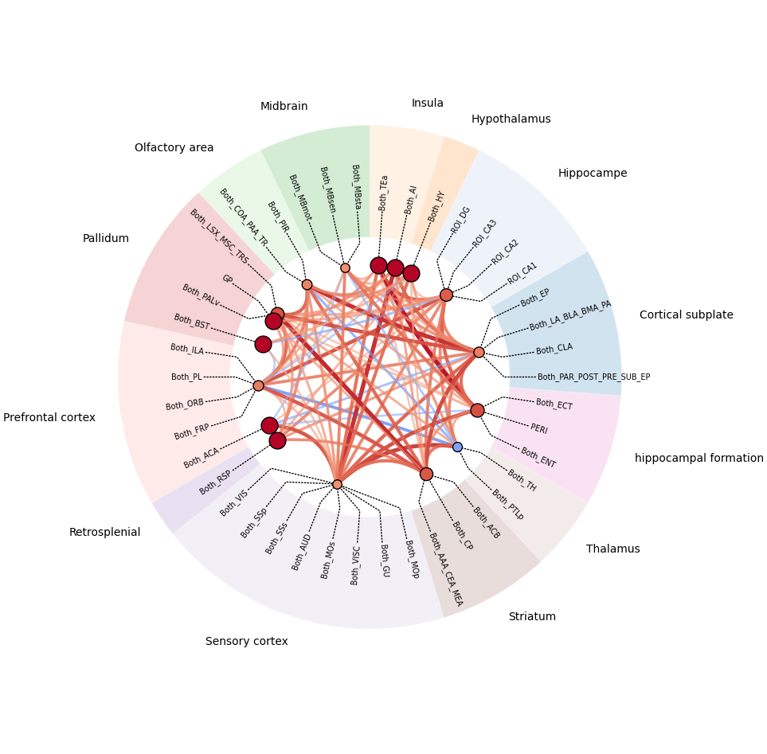
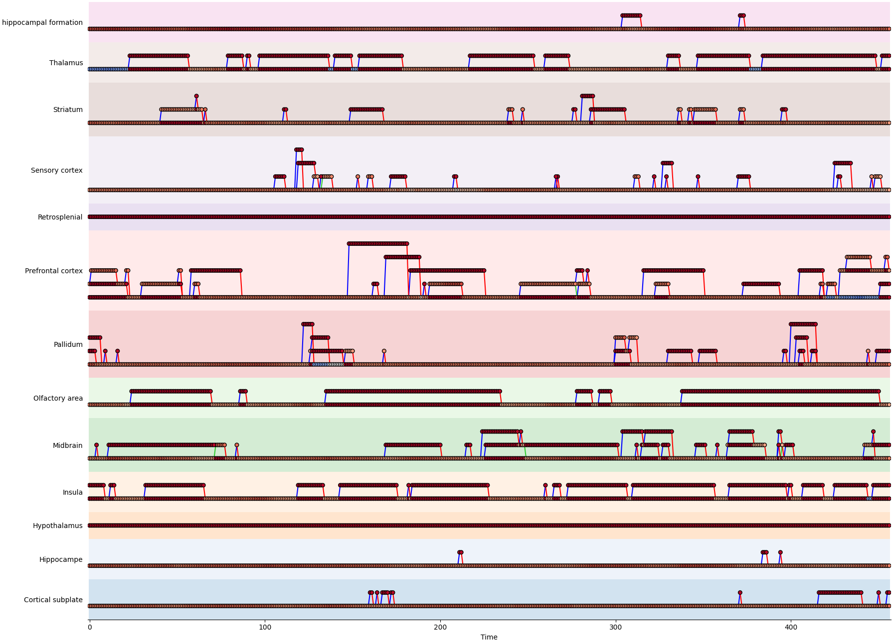
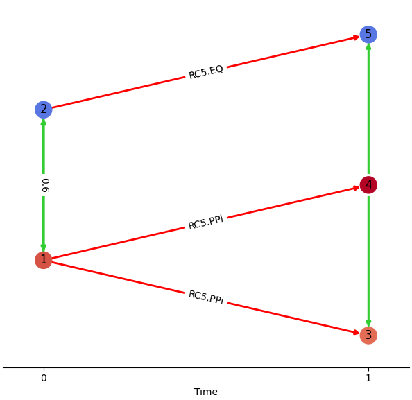

[](https://git.unistra.fr/jpontabry/mos-t_fmri/-/commits/main)

# fSTG Toolkit: an Open-Source Software for Spatio-Temporal Graph Analysis of fMRI data

This package allows you to build, plot, and simulate spatio-temporal graphs for fMRI data. This README provides a brief overview of the CLI tool usage, including installation instructions, usage examples, and detailed examples.

## Installation

To install the required dependencies, run:

```sh
conda env create -n <env_name> -f environment.yml
conda activate <env_name>
```

Then in the project's folder, run:
```sh
poetry install
```

## Usage

The CLI tool provides several commands grouped under `build`, `plot`, and `simulate`. Use the `--help` option to get help for each command. Examples and explanations are provided in the next section.

## Examples

### Build a Graph

Assume the timeseries of correlation matrices are stored in a numpy pickle file (`matrices.npz` or `matrices.npy`) and the definitions of the areas and regions are in a CSV file (`areas.csv`).

The areas/regions definition must be formatted as follows:

| Id_Area | Name_Area | Name_Region |
|---------|-----------|-------------|
| 1       | Area1     | Region1     |
| 2       | Area2     | Region1     |
| 3       | Area3     | Region2     |
| 4       | Area4     | Region3     |

Accordingly, the CSV file should look like this:

```csv
Id_Area,Name_Area,Name_Region
1,Area1,Region1
2,Area2,Region1
3,Area3,Region2
4,Area4,Region3
```

To build a spatio-temporal graph from the inputs and save the graph to the archive file `my_graph.zip`, use the command:

```sh
python -m fmri_st_graph build matrices.npz areas.csv -o my_graph.zip
```

### Plot a Graph

To plot a graph stored in the file `my_graph.zip` to a dynamic plot, use the command:

```sh
python -m fmri_st_graph plot my_graph.zip dynamic
```

Other available plot types include `spatial`, `command`, and `multipartite` (avoid this last one for large graphs due to memory issues).

Below is an examples of spatial plot.


Below is an example of temporal plot.


### Simulate a Pattern

To simulate a pattern, provide the description of networks across time, spatial, and temporal edges. The string syntax for a single network is `area_range,region,internal_strength`, where the area range is defined either by a single area ID or by a range between two IDs separated by a colon. Descriptions of multiple networks at a given time are concatenated with spaces. A `/` symbol separates networks of two different time instants. The whole description must be surrounded by quotes.

The syntax for a single spatial edge is `network1_id,network2_id,correlation`. Multiple descriptions are concatenated between quotes and separated by spaces.

The syntax for a single temporal edge is `network_id_range,network_id_range`, where the range can be either a single network ID or multiple IDs separated by a `-` character. The kind of edges is automatically inferred. For instance, `id,id` means an equal edge, `id-id,id` means a merge, and `id,id-id` means a split. Multiple descriptions are concatenated between quotes and separated by spaces.

Example command:

```sh
python -m fmri_st_graph simulate -o pattern.zip pattern "1:3,1,0.8 4:5,2,-0.8 / 1:2,1,0.7 3,1,1 4:5,2,-0.8" "1,2,0.6 3,5,0.5" "1,3-4 2,5"
```

This creates the pattern depicted in the following multipartite plot:



### Simulate a Sequence

A graph can be simulated from a sequence of pre-generated patterns. The sequence description consists of space-separated elements, which can be either a pattern (`p<n>`, where `n` is the order of the pattern passed to the command) or a number (`d`) to create `d` steady states.

Example command:

```sh
python -m fmri_st_graph simulate -o sequence.zip sequence pattern1.zip pattern2.zip pattern3.zip "p2 10 p3 5 p1"
```

### Simulate Correlations

To simulate a timeseries of correlation matrices from a spatio-temporal graph stored in `my_graph.zip` with a correlation threshold of 0.5, use the command:

```sh
python -m fmri_st_graph simulate -o correlations.npz correlations my_graph.zip -t 0.5
```

The output timeseries matrices will be saved in a numpy-compatible format. Use the `-o` option to set the output path.

[//]: # (## License)
[//]: # ()
[//]: # (TODO)