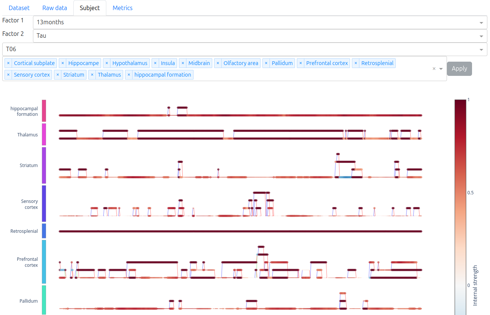

[](https://github.com/julienpontabry/fstg_toolkit/actions/workflows/ci.yml)


[](https://fstg-toolkit.readthedocs.io/)

# fSTG Toolkit: an Open-Source Software for Spatio-Temporal Graph Analysis of fMRI data

## Overview

**fSTG Toolkit** is an open-source software dedicated to longitudinal analysis of brain connectivity, modeling data as spatio-temporal graphs. It enables the study of dynamics and reorganization of brain regions, primarily using functional MRI (fMRI) data, but is also compatible with any type of connectivity data.

Current main features:
- Building of spatio-temporal graphs from correlation matrices and region definitions.
- Advanced graph metrics computation.
- Interactive visualization of results via a web dashboard.
- Simulation of connectivity patterns and sequences.
- Frequent subgraph pattern mining via SPMiner integration.

## Installation

### Installation from PyPI

The easiest way to get started is to install the package from PyPI. Make sure you have a Python environment ready with a supported version (see the badge above), then run:
```shell
pip install fSTG-Toolkit
```

To install optional feature sets:
```shell
pip install "fSTG-Toolkit[dashboard]"   # web dashboard
pip install "fSTG-Toolkit[plot]"        # matplotlib plots
pip install "fSTG-Toolkit[frequent]"    # frequent pattern mining (requires Docker)
pip install "fSTG-Toolkit[dashboard,plot,frequent]"  # everything
```

### Installation from Source

To install from source, create a new environment with the required Python and Poetry binaries. Using conda:
```shell
conda env create -n <env_name> -f environment.yml
conda activate <env_name>
```

Then in the project's root folder, install the dependencies:
```shell
poetry install
```

To install optional feature sets:
```shell
poetry install --extras dashboard   # web dashboard
poetry install --extras plot        # matplotlib plots
poetry install --extras frequent    # frequent pattern mining (requires Docker)
poetry install --all-extras         # everything
```

## Quick Start

```shell
# Build graphs from a correlation matrix file and an areas CSV
python -m fstg_toolkit graph build -o my_graphs.zip areas.csv matrices.npz

# Compute graph metrics
python -m fstg_toolkit graph metrics my_graphs.zip

# Open the interactive dashboard
python -m fstg_toolkit dashboard show my_graphs.zip
```

The areas CSV must contain `Id_Area`, `Name_Area`, and `Name_Region` columns. Correlation matrices must be NumPy files (`.npz` or `.npy`) with shape `(T, N, N)`.

Use `--help` on any command for full options:
```shell
python -m fstg_toolkit --help
python -m fstg_toolkit graph build --help
```

Full usage documentation, tutorials, and API reference are available at **[fstg-toolkit.readthedocs.io](https://fstg-toolkit.readthedocs.io/)**.


