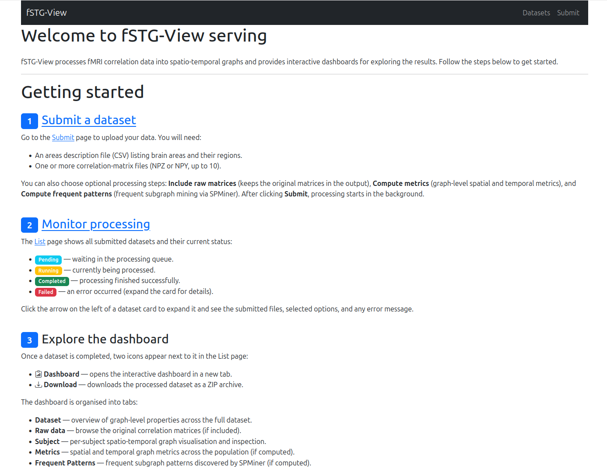
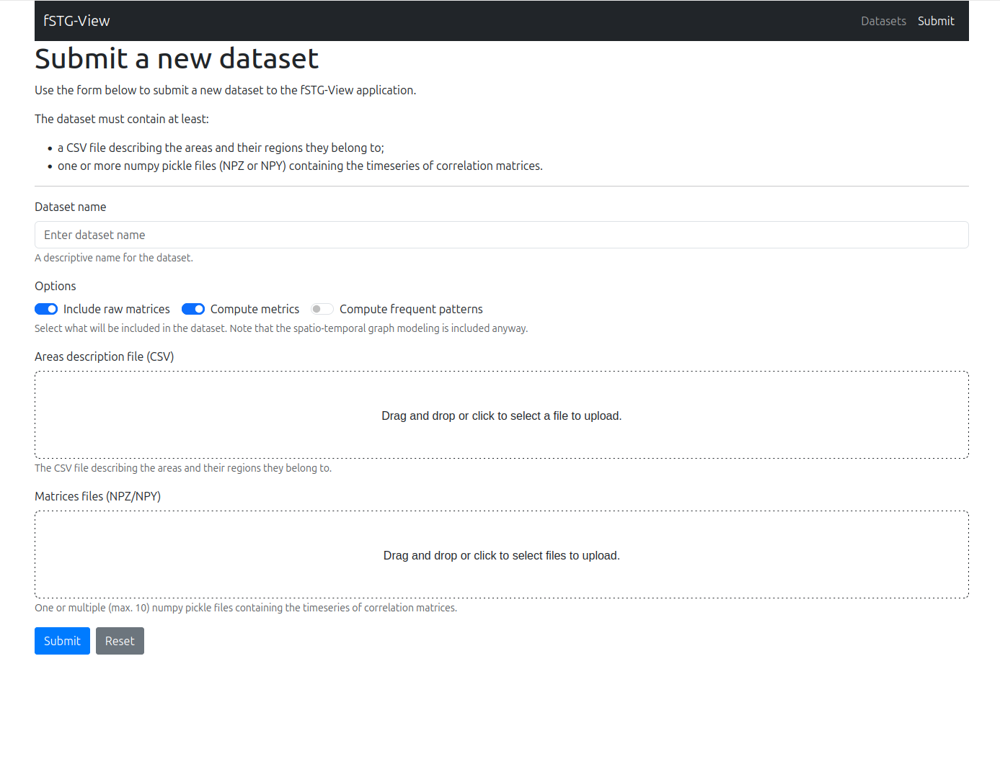
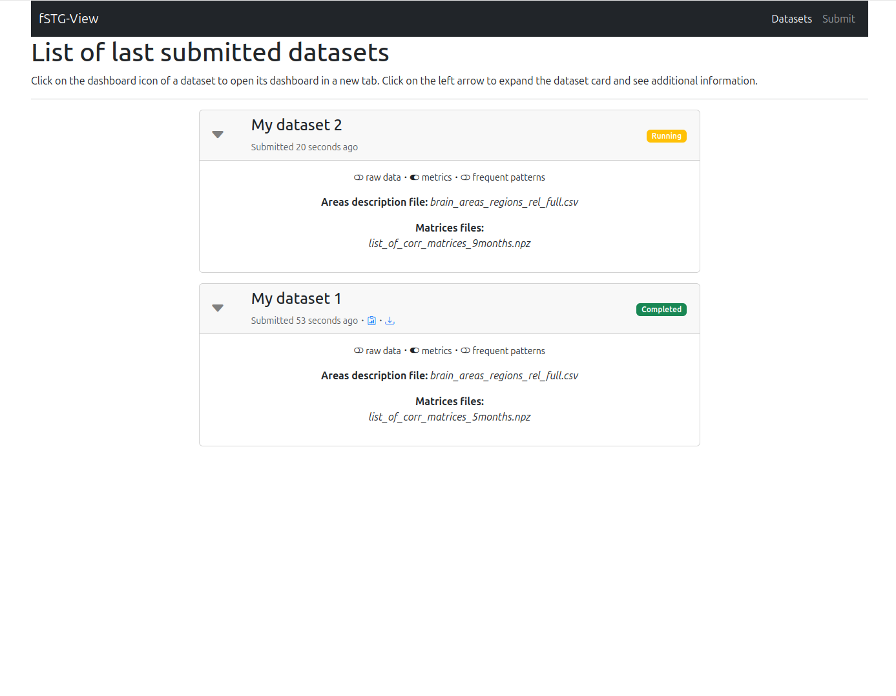
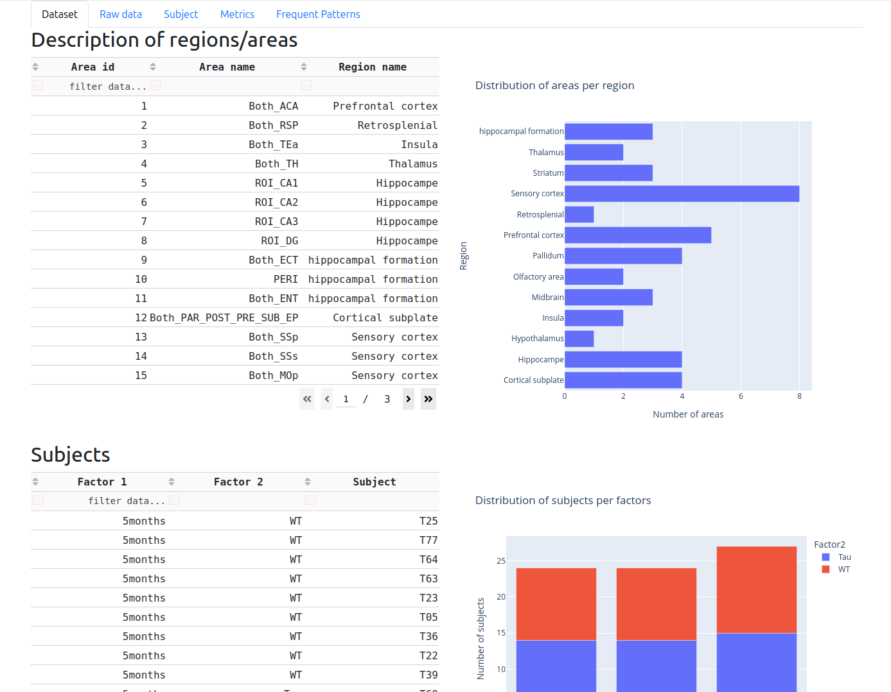
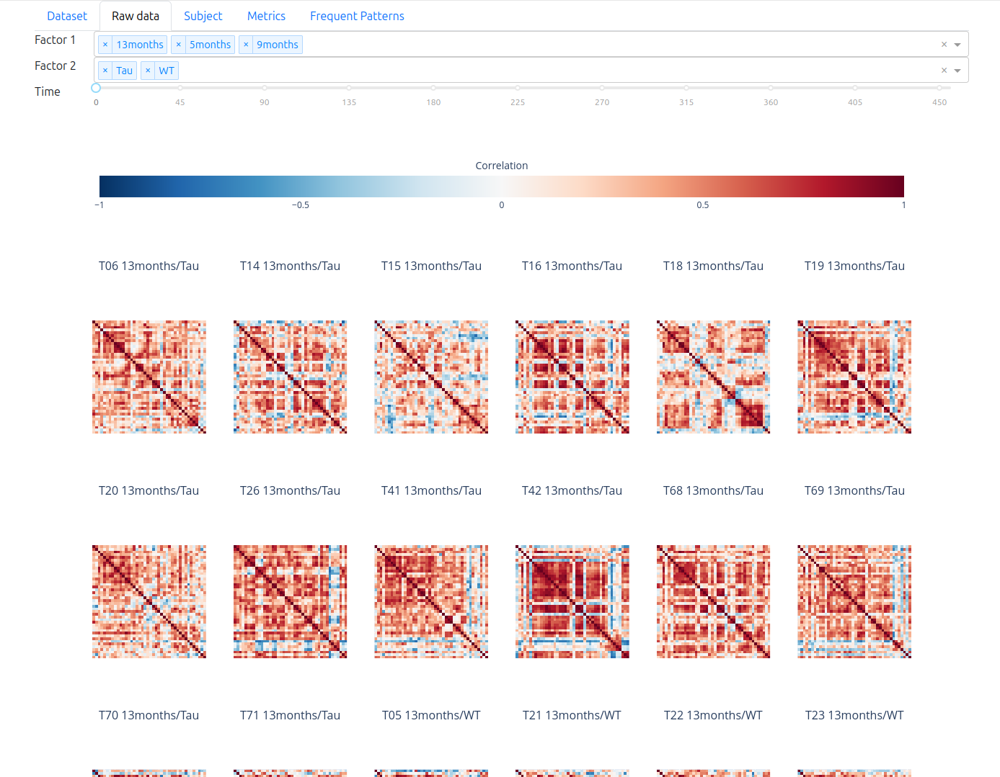
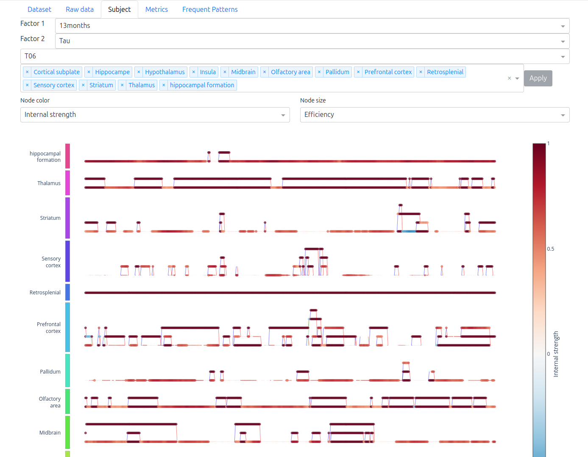
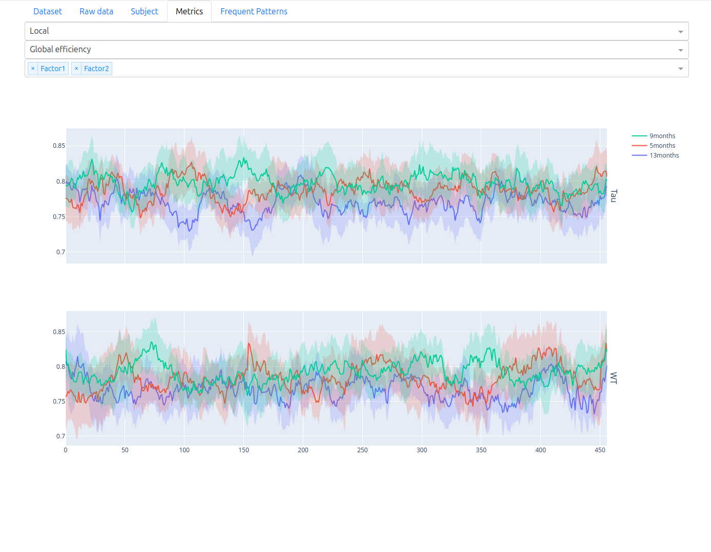
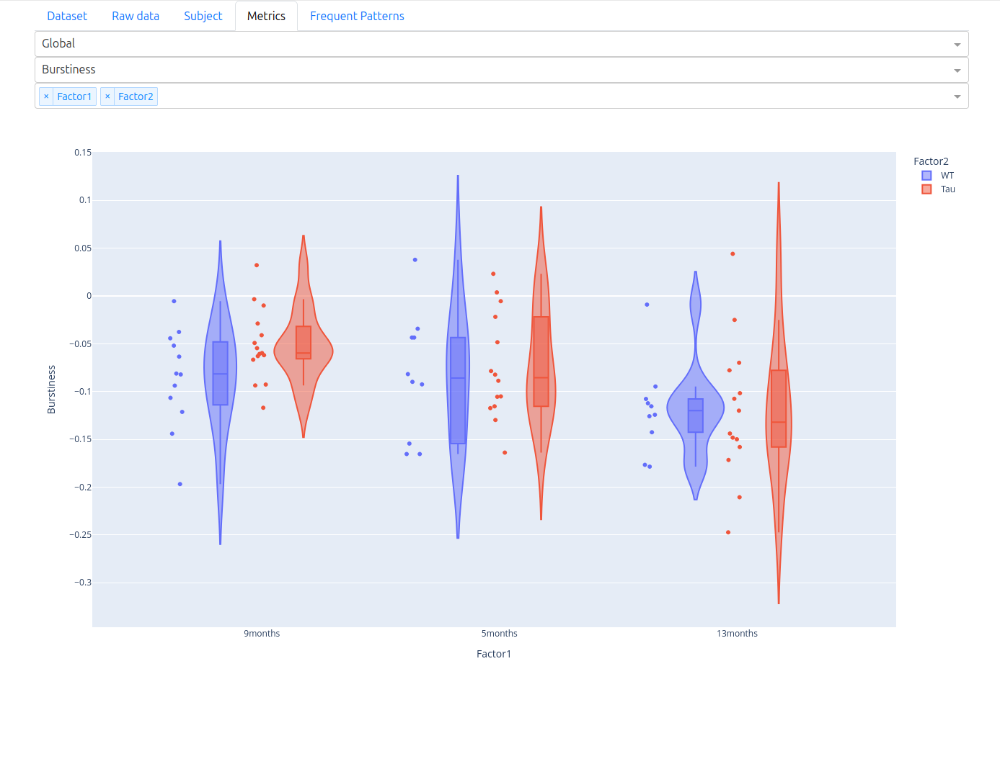
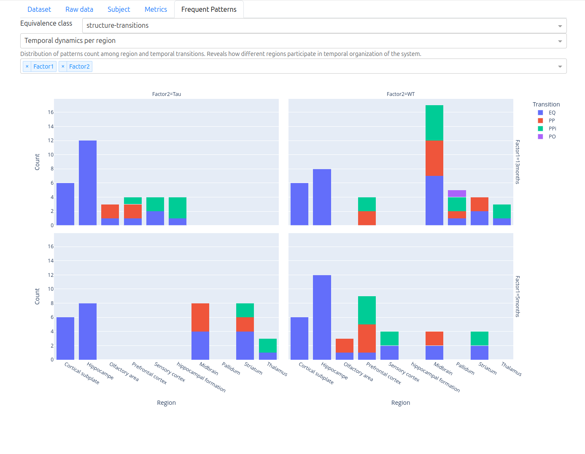

# Running the Dashboard

The fSTG Toolkit dashboard provides an interactive web interface for exploring spatio-temporal
graphs, metrics, raw correlation matrices, and frequent patterns.

## Prerequisites

Install the `[dashboard]` extra:

```shell
pip install "fSTG-Toolkit[dashboard]"
```

## One-Shot Mode: Exploring a Single Dataset

The `show` command starts a local server and opens your default browser automatically:

```shell
python -m fstg_toolkit dashboard show my_graphs.zip
```

The dashboard will be available at `http://127.0.0.1:8050/dashboard/<token>`.

### Options

| Flag | Default | Description |
|------|---------|-------------|
| `--port` / `-p` | `8050` | Port to listen on |
| `--no-browser` | off | Start the server without opening a browser tab |
| `--debug` | off | Enable Dash debug mode with hot-reload |

```shell
python -m fstg_toolkit dashboard show --port 8080 --no-browser my_graphs.zip
```

## Persistent Mode: Multi-Dataset Server

Use the `serve` command to run a persistent server that supports multiple datasets and file
uploads:

```shell
python -m fstg_toolkit dashboard serve /path/to/data /path/to/uploads
```

Both paths must be existing, writable directories.

### Options

| Flag | Default | Description |
|------|---------|-------------|
| `--port` / `-p` | `8050` | Port to listen on |
| `--db-path` / `-d` | `./data_files.db` | SQLite database for tracking uploaded datasets |
| `--token-size` / `-t` | `3` | Token length for dataset URLs (increase for many simultaneous users) |
| `--debug` | off | Enable Dash debug mode |

### Home Page

The home page gives a step-by-step overview of the workflow: submit a dataset, monitor
processing, and then explore the dashboard once processing is complete.



### Submitting a Dataset

The **Submit** page (persistent mode only) lets you upload a new dataset to the server.
Provide a name, select your areas CSV file and one or more matrix files (NPZ or NPY),
and choose which optional processing steps to run:

- **Include raw matrices** — keep the original matrices in the output archive.
- **Compute metrics** — calculate spatial and temporal graph metrics.
- **Compute frequent patterns** — run frequent subgraph mining via SPMiner (requires Docker).

After clicking **Submit**, processing starts in the background and the dataset appears
in the list with a *Pending* status.



### Dataset List

The **Datasets** page lists all submitted datasets and their current processing status.
Each card can be expanded to show the submitted files and any error messages.

Datasets go through four states:

| Badge | Meaning |
|-------|---------|
| **Pending** | Waiting in the processing queue |
| **Processing** | Currently being processed |
| **Completed** | Processing finished successfully |
| **Failed** | An error occurred — expand the card for details |

Click the **Dashboard** icon next to a completed dataset to open it in a new tab, or the
**Download** icon to retrieve the processed ZIP archive.



## Dashboard Pages

Once a dataset is opened, the dashboard provides five tabs for interactive exploration.

### Dataset Tab

The **Dataset** tab gives a global overview of the loaded data: the list of brain
regions/areas with their identifiers and region names, a bar chart of how many areas
belong to each region, and a table of all detected subjects with their factor breakdown
and a stacked bar chart of their distribution.

Use this tab to verify that the toolkit parsed your areas CSV and matrix filenames
correctly before exploring further.



### Raw Data Tab

The **Raw data** tab shows heatmap visualisations of the original correlation matrices
before graph construction. Use the **Factor 1**, **Factor 2**, and **Time** dropdowns at
the top to filter which matrices are displayed. This is useful for a sanity check of the
raw correlations and for spotting noisy or outlier subjects.



### Subject Tab

The **Subject** tab displays the spatio-temporal graph for a single subject as an
interactive multipartite plot — areas on the vertical axis, time steps on the horizontal
axis. Spatial edges (functional connectivity) appear as horizontal links; temporal edges
(RC5 relations) connect the same area across consecutive time steps.

Use the **Factor 1**, **Factor 2**, and **Title** dropdowns to select the subject, then
choose the **Node color** and **Node size** metrics from the dropdowns below the graph
to highlight specific graph properties. Hover over nodes and edges for detailed values.



### Metrics Tab

The **Metrics** tab provides interactive charts of the computed graph metrics.

Switch between **Local** and **Global** in the first dropdown:

- **Local** — per-node spatial metrics (e.g., efficiency, clustering) plotted as time
  series across subjects. Select a metric and use the factor dropdowns to compare groups.
  Each factor level is shown as a coloured band (mean ± standard deviation).

  

- **Global** — per-graph temporal metrics (e.g., burstiness) shown as violin plots across
  factor levels, making group differences immediately visible.

  

### Frequent Patterns Tab

The **Frequent Patterns** tab is available after running frequent subgraph pattern mining.
It shows how discovered patterns distribute across brain regions and RC5 temporal
transitions, broken down by factor level. Use the **Equivalence class** and
**Temporal dynamics** dropdowns to navigate between pattern families.



## Factor and Subject Filtering

If your matrix names follow the `factor_factor_subject` naming convention, the dashboard
automatically detects factors and presents them as filter dropdowns throughout all tabs.
See [Usage: Factor and Subject Detection](../usage.md#factor-and-subject-detection) for details.

## Next Steps

- [Frequent Pattern Mining](frequent_patterns.md) — discover recurring connectivity patterns
- [API Reference: app](../api/app/index.rst) — dashboard internals
