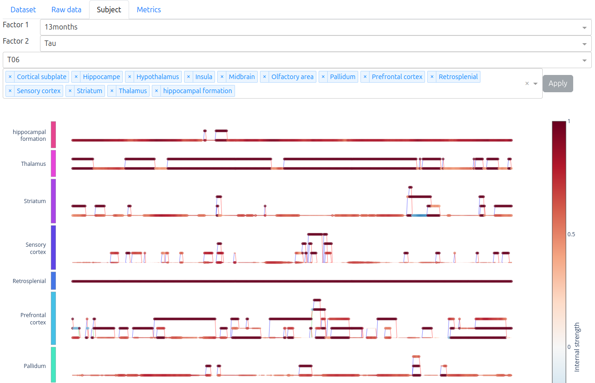

# Summary

A functional MRI session is usually reduced to a single connectivity matrix per subject, which averages away the very thing longitudinal studies want to observe: how connectivity reorganizes. Some methods use sliding window techniques to produce a sequence of matrices for many timepoints, but the actual reorganization between timepoints is often overlooked. fSTG-Toolkit turns a sequence of connectivity matrices into a single graph object that keeps the time axis. This spatio-temporal graph is composed of three families of elements:

- nodes are sets of correlated brain areas inside a region, at a given timepoint;
- spatial edges link two such sets at a given timepoint;
- temporal edges link the sets between timepoints and carry a label describing the temporal change.

fSTG-Toolkit provides everything necessary to build such a graph and analyze it: spatial and temporal graph metrics, frequent pattern mining across subjects and interactive visual exploration. Its core is written in pure Python, and it is built upon NetworkX [@hagberg2008networkx] and installable from PyPI. It is usable through a command-line tool, a Python API, or a web dashboard.

# Statement of need

Dynamic connectivity studies aim to describe how cerebral connectivity reorganizes over time. However, neither of the two main approaches makes the transition between successive timepoints explicit:

- static pipelines integrate the time axis into one correlation matrix;
- dynamic pipelines produce a sequence of brain states using sliding windows and clustering [@hutchison2013dynamic; @allen2014tracking; @preti2017dynamic].

In practice, pipelines in labs are often assembled by hand from general-purpose Python libraries such as NetworkX, Nilearn [@nilearn] and pandas. Such workflows are typically written for a single study and seldom released, which limits their reuse and reproducibility across cohorts.

The toolkit presented in this article implements a serializable longitudinal connectivity graph whose temporal edges carry an interpretable and mutually exclusive relation vocabulary. Because the reorganization is encoded in the structure of the graph, it becomes directly measurable and minable:

- reorganization rate and the distribution of transition types;
- burstiness and memory of reorganization events, borrowed from temporal network analysis [@goh2008burstiness; @holme2012temporal];
- subgraph patterns recurring across subjects, based upon Multi-SPMiner [@zeghina2023multispminer].

The purpose of fSTG-Toolkit is to widen the available tools studying the reorganization in network neurosciences [@bassett2017network]. While its focus is brain connectivity, its only input requirement is a sequence of correlation matrices and a parcellation table.

Note that this toolkit does not include a preprocessing pipeline: the raw BOLD signal must be processed in the standard ways before use. Also, it does not include the exhaustive metric catalogues of the established graph theory toolboxes.

# State of the field

The Brain Connectivity Toolbox [@rubinov2010bct] and the GUI-driven toolboxes built around it (e.g. GraphVar [@kruschwitz2015graphvar; @waller2018graphvar2], GRETNA [@wang2015gretna] or BRAPH [@mijalkov2017braph; @tiunn2026braph2]) are mature and have exhaustively documented metric catalogues that set the field standard for static analyses. However, they rely on a single connectivity matrix as unit of analysis. Time is accounted for only as repeated, independent analyses, and the results must be compared externally. The closest exception is BRAPH 2 [@tiunn2026braph2], which supports both longitudinal comparison of the same subjects across timepoints and multilayer networks, in which a node is duplicated across layers and linked by coupling edges. However, those coupling edges are untyped identity links, so the transition itself still carries no information about what changed.

For capturing temporal variability, sliding-window methods like ICA with k-means clustering pipelines [@allen2014tracking] and toolboxes such as DynamicBC [@liao2014dynamicbc] are field standard. Their limit originates from the association of one label per window: the local topological relations between successive windows are discarded and the results are highly dependent on the window length and the number of clusters [@lurie2020questions].

A Python ecosystem has since grown around this family: teneto [@thompson2017teneto] for temporal-network measures on fMRI, dyconnmap [@marimpis2021dyconnmap] and DySCo [@dealteriis2025dysco] for dynamic connectivity estimation, and the Comet toolbox [@burkhardt2026comet] for assembling and comparing dynamic connectivity pipelines. All of them quantify how connectivity varies over time, but the relation between two consecutive configurations remains untyped: none of them labels what happened to a given group of areas between two timepoints.

fSTG-Toolkit does not replace these tools; it complements them. To the authors' knowledge, it is the first openly available toolkit for brain connectivity that simultaneously

1. encodes inter-timepoint reorganization as a typed graph structure using a region connection algebra and
2. ships an end-to-end software from matrices to graph, to metrics, to frequent patterns mining and to interactive exploration in one tool.

# Software design

Each correlation matrix is thresholded into a graph. Within each user-defined region (grouping areas), the connected components of that graph are collapsed into a single node, so a node represents a set of areas in a given region at a given timepoint. This is what makes the transitions algebra definable: the relations between successive sets have a direct interpretation. As a counterpart, individual areas are no longer structural elements, although the information is preserved in each node's attribute. See \autoref{fig:concept}(A-B).

The RCC-5 model has been chosen as temporal transition algebra because it offers five exhaustive and mutually exclusive relations [@randell1992]: unchanged (EQ), grown (PP), shrunk (PPi), partially reorganized (PO) and disconnected (DR). With this transition vocabulary, a neuroscientist can read the meaning directly from its visualization and a subgraph mining algorithm can operate on its finite states. However, the magnitude of the change is lost: for instance, gaining one area or gaining twenty areas both yield the same PP label. An example is illustrated in \autoref{fig:concept}(C).

A spatio-temporal graph is implemented as a subclass of the NetworkX `DiGraph` class. This choice makes the entire package's ecosystem available and encompasses both representation of spatial and temporal edges, at a cost of storing twice the spatial edges. Then, most metrics are a few lines long, without having to convert between structures.

The core of the toolkit depends only on NetworkX [@hagberg2008networkx], NumPy [@harris2020numpy], pandas [@mckinney2010pandas] and Click, plus a few small helper packages. Opt-in extras add plotting with Matplotlib [@hunter2007matplotlib], the dashboard with Dash/Plotly [@dash] and frequent pattern mining. The latter relies on Multi-SPMiner [@zeghina2023multispminer], the authors' adaptation of SPMiner [@ying2024spminer] to spatio-temporal graphs, shipped alongside fSTG-Toolkit and run in a Docker container to avoid dependency conflicts. Therefore, it requires a running Docker daemon, and the first run is slowed by the build of the image.

The dashboard, available with the `dashboard` extra, lets the user explore interactively the spatio-temporal graphs, the metrics and the frequent patterns. It comes in two flavors: a local dashboard that opens a single result archive, and a service on local network where users can upload a dataset, start its processing and return later to explore the results. \autoref{fig:dashboard} shows the graph view.

As the metrics are declared through a decorator-based registry, the users can add their own on the fly, without forking the repository.

All artifacts (raw matrices, graphs in JSON, metrics and mined patterns) are stored in one ZIP archive, making results traceable and shareable. A data registry and handler protocol allow new kind of artifact without changing the container's format.

The toolkit also ships a simulator that generates spatio-temporal graph patterns and full sequences with known ground truth. It can be used to study the behavior of the metrics and the pattern mining, without any real data.

Two limits follow from these choices. First, the correlation threshold is a user parameter that applies to the whole sequence and its choice can be difficult and arbitrary. Furthermore, results can change depending on this threshold. Second, the toolkit includes metrics but performs no group-level statistical inference: comparisons between subjects or cohorts are descriptive. Two conventions are also worth noting: burstiness and memory return sentinel values when a graph contains no or too few reorganization events and single-area networks are assigned an efficiency of 1.

Finally, the toolkit is extensively tested, with more than four thousand lines of tests plus executed doctests, run in continuous integration on Linux and macOS across Python 3.12 and 3.13. However, the Dash callbacks are only tested manually rather than by automated tests.

# Research impact statement

The frequent pattern mining component is the reference implementation of the authors' published spatio-temporal graph mining research: Multi-SPMiner [@zeghina2023multispminer] and continued in DeepQMiner [@zeghina2025deepqminer]. See @zeghina2024review for a landscape survey of this research area. By encapsulating in a software the outcome of this research, fSTG-Toolkit is what makes that work usable on brain connectivity data by researchers who are not graph-mining specialists.

The toolkit has been presented to the community during a live software demonstration at the 2026 IEEE ISBI conference [@pontabry2026isbidemo]. The source code is available on [GitHub](https://github.com/julienpontabry/fstg_toolkit), has been released and published on [PyPI](https://pypi.org/project/fSTG-Toolkit/), and is formally deposited on HAL [@pontabry2026software]. The full documentation for concepts, installation and usage is accessible on its [ReadTheDoc](https://fstg-toolkit.readthedocs.io/en/latest/) page.

Development has been driven by real data: the toolkit was built and validated against a mouse-model functional connectivity dataset, and user-tested by neuroscientists. It is being adopted in the authors' laboratory to support ongoing studies on brain reorganization dynamic. Because the only assumptions on the inputs are a sequence of correlation matrices and a parcellation table, applications outside neurosciences, e.g. the reorganization of territorial data, are also under investigation.

# AI usage disclosure

Generative AI assistance was used in preparing the software documentation, in structuring the outline of this manuscript and in reformulating some parts of the text. Its use in the source code was limited to occasional targeted assistance in resolving specific implementation problems. The problem framing, the spatio-temporal graph and RCC-5 data model, and all architectural decisions presented in this article are the authors' own. The authors have reviewed and tested all code and documentation and take full responsibility for the content and claims of this work.

# Acknowledgements

This work was funded by the ANR MoS-T project (grant ANR-21-CE23-0015). The authors thank the IMIS research team at ICube for user testing and especially Laetitia Degiorgis for providing the mouse-model functional connectivity dataset used during the development.

# References

